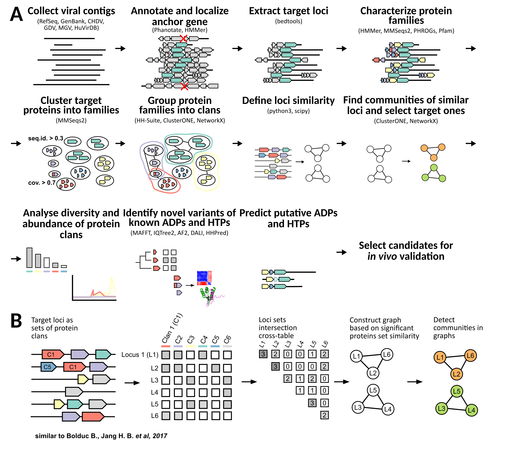

# Exploring the Diversity of Host Takeover and Anti-Defence Genes in Specific Hot-spots of Bacteriophage Genomes

## Author: Oksana Kotovskaya, Skoltech

---

This repo contains code for a Master Thesis project, performed by the author in Skoltech Laboratory of Metagenome Analysis.

## Background
Bacteriophages are viruses of bacteria, their population exceed bacteria one by several orders of magnitude. This pressure on bacteria led to an emergence of different defense (of immune) systems. This, in turn, led to an emergence of anti-defense genes which allow bacteriophages to avoid the bacterial immunity.  
The defense systems are diverse and prevalent. 
On average, bacteria carry 5 known defense systems with different mechanisms of action. 
For now, we know hundreds of defense mechanisms. 
The anti-defense genes utilized by bacteriophages are less studied, since these mechanisms were discovered sporadically during the study of particular phage-host interaction. 
Systematic prediction is complicated by the following things:  
- phages mutate rapidly, so even relatives-proteins have a low level of homology - this homology is below 30%, we can not use standard methods, thus, we cannot find genes with a known function among a bunch of unknown ones. 
- phage genomes are constantly recombining, which leads to the fact that we have a constant shuffling of genome loci and even genes, that is, there is a constant shuffling of domains. 
- anti-defense proteins can localize anywhere.  
Simply, we yet had no idea where to find them, how to find known genes within a pool of unknown ones and how to deal with hypervariability of genomic loci encoding genes specialized for hosts. 

Thus, the goal of the project was to develop an approach to overcome these problems.


## Pipeline overview

This research is based on the methodology of comparative genomics. 
First, the dataset is formed, based on the hypothesis about the localization of genes of particular groups (anti-defence and host takeover genes in this research) in a particular genome locus. 
Loci with the particular gene marker (e.g. RNA polymerase gene 1 or _cIII_) are found by searching protein-coding sequences with the help of position-specific scoring matrices (PSSMs, PSI-BLAST). 
Then genomes are downloaded and open reading frames (ORFs) of these genomes are annotated with Prodigal or Phanotate depending on the origin of the locus. 
Based on the initial hypothesis, the loci of interest are selected. 
The translations of ORFs in these loci are clustered in protein homology groups.
Next, the co-localization of genes of these homology groups is evaluated and groups of similar loci are determined.
The homology group genes are characterised in two ways: (i) search for frequent genes, and (ii) search for genes substituting already known genes of interest in a group of loci similarity.
For all novel findings, functional annotation is performed, according to the PFAM-A (with the help of HMMER), and PHROGs (with the help of MMSeqs2) databases.


A, Overview of the pipeline. First, sequences that potentially encode anchor protein are selected and annotated. The sequences encoding the anchor gene are passed to the next steps. Second, target loci are selected, and the protein sequences encoded in these regions are extracted and characterised based on their domain organisation and chemical properties. Third, proteins encoded in target loci are classified into protein families and protein clans. Next, target loci are classified into communities, based on their clans’ content similarity. Finally, communities of interest are selected, and proteins, encoded in these loci, are analysed, based on their diversity, abundance, and domain mosaicism. Putative ADPs and HTPs are predicted, based on their localization. Remarkable proteins are selected for _in vivo_ validation. 
B, The scheme of loci similarity definition. First, the target loci are represented as sets of protein clans. Second, the intersections of these sets are found, and the similarity score is calculated based on these intersections’ cardinality. Third, a network is built, where nodes represent the loci and they are linked in a case of significant similarity score. Finally, communities of similar loci are found.


## Reproducibility
All steps of analysis excliding the analysis of obtained data, were performed with Snakemake v.7.25.2 (Snakefiles located in `workflow` folder).
All dependencies for all steps are specified in `workflow/envs` folder. 

Launch of particular part of pipeline (on the example of performing clustering of protein sequences in target regions):
```commandline
snakemake --use-conda --configfile config_autographiviridae.yaml --snakefile workflow/snake_clustering.Snakefile -c 20
```
Parameters:
- `--use-conda` allows to build individual conda-environments for packages automatically and separate each dependency group;
- `--configfile config_autographiviridae.yaml` specifies the config file, in which all paths of input, output files and parameters are specified (e.g. `clu_min_cov: 0.7` means that for the clustering the min coverage threshold is 0.7);
- `--snakefile workflow/snake_clustering.Snakefile` specifies the pipeline desired to launch;
- `-c 20` specifies the number of threads used.

## In case of any questions, suggestions, and comments, contact the author (kotovskaya.oa@outlook.com)
